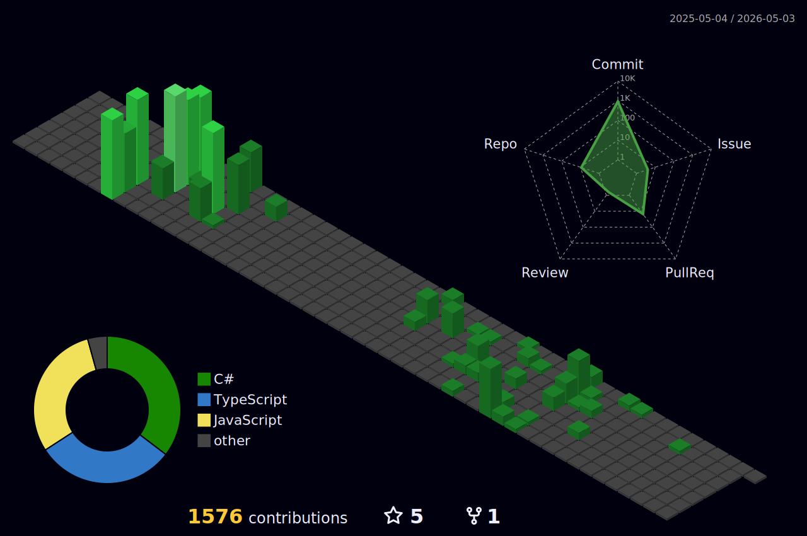

  

  

  
  
  

---

## About

Backend C# for about ten years. Three jobs:

- **Elbit** (2014-18). Instructor consoles for military simulators. WPF.
- **KLA** (2019-24). Cleanroom inspection tools for semiconductor fabs. Lots of fab travel.
- **WEM** (2025-now). Leading the software side of grid-scale battery storage. C# microservices, React, PostgreSQL. Some LLM integration too (Claude, Gemini, MCP).

More at [eladser.dev](https://eladser.dev).

---

## Projects

### [Seerlens](https://github.com/eladser/seerlens)

Local DevTools for AI calls. See every LLM call your app makes: the prompt, the cost, the latency, the tool calls, and whether answer quality is quietly regressing. Like a Network tab pointed at your models. There's an eval engine too, score answers against a golden set and the trend catches the drop when you switch to a cheaper model.

ASP.NET Core 9 + SQLite + React, built on OpenTelemetry. SDKs for .NET, Python, and JavaScript; installs as a dotnet tool.

[source](https://github.com/eladser/seerlens), [nuget](https://www.nuget.org/packages/Seerlens)

### [AeroLens](https://aerolens.eladser.dev)

Real-time flight tracker. Predicts delays through a Groq, Mistral, Gemini fallback chain. You add your trips and it pings you when something changes.

React 19 + ASP.NET Core 8 + SignalR. Vercel, Northflank, Supabase, Upstash.

[live](https://aerolens.eladser.dev), [source](https://github.com/eladser/AeroLens)

### [ASP.NET Debug Dashboard](https://github.com/eladser/AspNetDebugDashboard)

Telescope-style debug panel for .NET. Drop the NuGet into an ASP.NET Core app and you get a live view of every request, the EF Core queries it ran, exceptions, timings. SignalR updates as they happen. Not much to configure.

[source](https://github.com/eladser/AspNetDebugDashboard), [nuget](https://www.nuget.org/packages/AspNetDebugDashboard)

### [SimpleConfigDiff](https://eladser.github.io/SimpleConfigDiff/)

Diff config files in your browser. Knows that `"true"` and `true` should match. Handles the formats people actually use (JSON, YAML, XML, INI, TOML, ENV, HCL, CSV). Nothing leaves the tab.

React 18 + TypeScript + Vite.

[live](https://eladser.github.io/SimpleConfigDiff/), [source](https://github.com/eladser/SimpleConfigDiff)

### [.NET Tools](https://eladser.github.io/.net-tools)

Around 30 small dev utilities. Passwords, hashes, encoding, JSON, GUIDs, the usual. All in the browser, nothing sent anywhere.

[live](https://eladser.github.io/.net-tools), [source](https://github.com/eladser/.net-tools)

---

## Stack

| Area | What I reach for |
|---|---|
| Backend | C#, .NET, ASP.NET Core, EF Core, SignalR |
| Frontend | React, TypeScript, Tailwind, Vite |
| Database | PostgreSQL, SQL Server, MongoDB |
| Cloud / infra | AWS, Azure, Docker, Terraform |
| AI / LLM | Claude, Gemini, Groq, Mistral, MCP servers, agents/skills |

Older stuff: WPF, WCF, C++, Java from Elbit. Blazor, Angular from KLA.

---

## Currently

- WEM platform. Leading two engineers on grid-scale battery dispatch.
- LLM integration. MCP servers, agent orchestration, fallback patterns.
- Seerlens. A local tool for watching and evaluating LLM calls. Current side project.
- If you're building dev tooling and want a second pair of hands, say hi.

---

## Stats

  
  

  

  

  

  

---

  <a href="https://eladser.dev">eladser.dev</a> · <a href="mailto:elad.ser@gmail.com">elad.ser@gmail.com</a>

